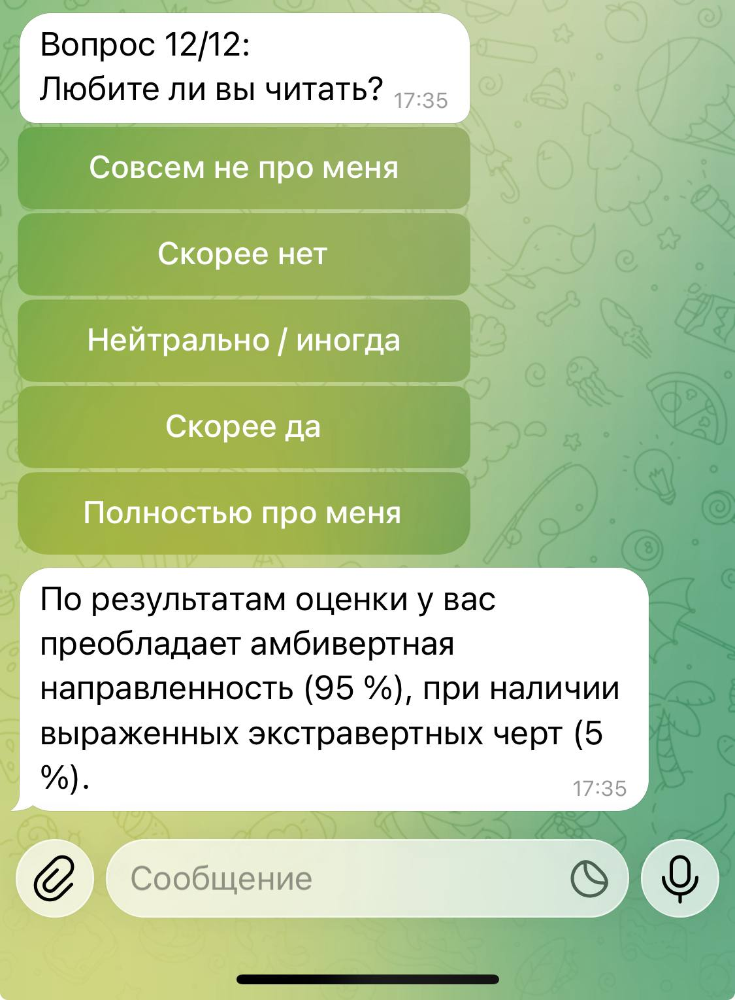

# 🧠 Классификация типов личности (Extrovert / Introvert / Ambivert)

## 💡 Дисклеймер
 Это синтетический датасет, созданный исключительно для обучения, исследований и экспериментов. Он не отражает реальных людей или психометрию. Исходные данные (https://www.kaggle.com/datasets/miadul/introvert-extrovert-and-ambivert-classification)

## Описание
Проект по классификации типов личности на основе 29 поведенческих признаков.

## Результаты:
EDA смотреть в Notebook 01_eda.
Модели хранятся в Notebooks:
* 04_LogReg
* 05_random_forest
* 06_xgboost

## Финальная модель обучена на 12 признаках (см. артефакт models/log_reg_12Features.pkl).

## Метрики
**Accuracy**  0.995
| Class | Precision | Recall | F1-score | Support |
|-------|-----------|--------|----------|---------|
| 0     | 0.99      | 0.99   | 0.99     | 1315    |
| 1     | 1.00      | 0.99   | 1.00     | 1371    |
| 2     | 1.00      | 1.00   | 1.00     | 1314    |
| **Macro avg** | 0.99  | 1.00   | 0.99     | 4000    |
| **Weighted avg** | 1.00 | 0.99 | 1.00     | 4000    |

## Пример использования модели с Telegram ботом
## Ссылка на бот: https://t.me/Personalitytypepredictbot

## Демо:

